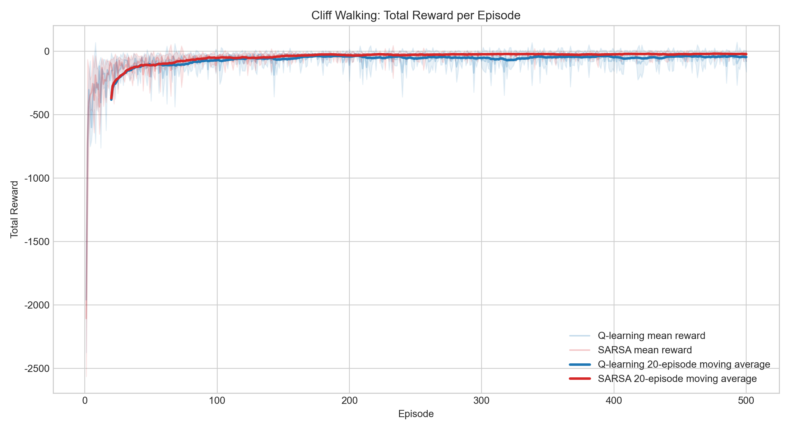
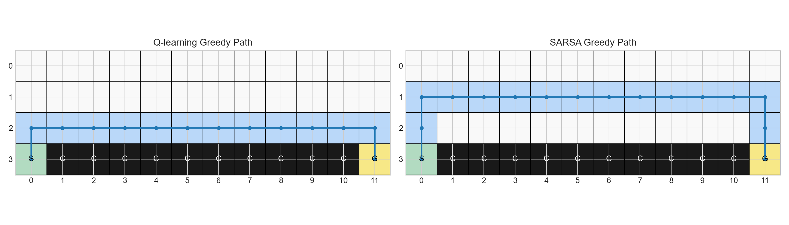

# HW2: Q-learning 與 SARSA 演算法之比較研究

## 一、作業目的

本作業實作並比較兩種經典強化學習演算法 `Q-learning` 與 `SARSA`。兩者在相同的 `Cliff Walking` 環境與相同超參數下進行訓練，藉此分析其學習行為、收斂特性、穩定性，以及最終策略的差異。

## 二、環境描述

本實驗採用 `4 x 12` 的 `Gridworld`，也就是經典的 `Cliff Walking` 環境。

- `Start` 位於左下角 `(3, 0)`
- `Goal` 位於右下角 `(3, 11)`
- 底部第 1 到第 10 欄為 `Cliff`
- 代理掉入懸崖時，立即得到 `-100` 獎勵，並回到起點
- 每走一步的獎勵為 `-1`
- 到達終點後該回合結束

## 三、問題設定

本次實驗使用以下設定：

| 項目 | 設定 |
| --- | --- |
| 狀態空間 | 所有網格位置 |
| 動作空間 | 上、下、左、右 |
| 策略 | `epsilon-greedy`, `epsilon = 0.1` |
| 學習率 | `alpha = 0.1` |
| 折扣因子 | `gamma = 0.9` |
| 訓練回合數 | `500` |
| 獨立實驗次數 | `30 runs` |

說明：為了讓結果比較更穩定，本次不是只跑單一次訓練，而是用相同設定重複執行 `30` 次，圖表與統計值以平均結果為主。

## 四、演算法實作

本次實作兩種方法：

### 1. Q-learning

`Q-learning` 為離策略（Off-policy）方法，更新式如下：

```text
Q(s_t, a_t) <- Q(s_t, a_t) + alpha * [r_{t+1} + gamma * max_a Q(s_{t+1}, a) - Q(s_t, a_t)]
```

更新時使用的是下一狀態的最佳可能行動價值，因此傾向學到理論上的最優策略。

### 2. SARSA

`SARSA` 為同策略（On-policy）方法，更新式如下：

```text
Q(s_t, a_t) <- Q(s_t, a_t) + alpha * [r_{t+1} + gamma * Q(s_{t+1}, a_{t+1}) - Q(s_t, a_t)]
```

更新時使用實際採取的下一個動作，因此會把 `epsilon-greedy` 探索策略的影響直接反映到學習過程中。

## 五、訓練與結果分析

### 1. 實驗輸出檔案

- 程式碼：[hw2_cliff_walking.py](/Users/bibi/Desktop/iot-hw2/hw2_cliff_walking.py)
- 完整報告：[hw2_report.md](/Users/bibi/Desktop/iot-hw2/hw2_report.md)
- 數值摘要：[outputs/summary.json](/Users/bibi/Desktop/iot-hw2/outputs/summary.json)
- 獎勵曲線：[reward_curves.png](/Users/bibi/Desktop/iot-hw2/outputs/reward_curves.png)
- 最終路徑圖：[final_paths.png](/Users/bibi/Desktop/iot-hw2/outputs/final_paths.png)

### 2. 學習表現

本實驗以每回合總獎勵（Total Reward）衡量學習表現。由於每一步都是負獎勵，因此「數值越高、越不負」表示表現越好。



根據 `30 runs` 的平均結果：

| 指標 | Q-learning | SARSA |
| --- | ---: | ---: |
| 全部回合平均 reward | `-72.01` | `-51.43` |
| 最後 100 回合平均 reward | `-48.54` | `-24.32` |
| 最後 100 回合 reward 標準差 | `12.15` | `4.27` |
| 最後 100 回合平均掉崖次數 | `0.317` | `0.050` |

結果顯示，`SARSA` 在固定 `epsilon = 0.1` 的訓練條件下，平均總獎勵明顯優於 `Q-learning`。這代表在訓練過程中，`SARSA` 更能避免高風險的掉崖行為。

### 3. 收斂速度比較

為了讓「收斂較快」有明確定義，本報告使用以下代理指標：

- 先計算 `20-episode moving average`
- 再看該平均值何時進入「最後 50 回合平均 reward 的 5 分容忍範圍內」
- 若連續維持 `10` 個 moving-average 點，則視為進入穩定區

依此定義得到：

| 方法 | 估計收斂回合 |
| --- | ---: |
| Q-learning | `170` |
| SARSA | `235` |

因此，若以「曲線何時進入自己的穩定區間」來看，`Q-learning` 較快形成固定行為模式；但這個穩定模式本身仍伴隨較多風險，因此並不代表它的訓練表現更好。

### 4. 策略行為與最終路徑



代表性訓練結果顯示：

- `Q-learning` 的最終貪婪路徑長度為 `13`
- `SARSA` 的最終貪婪路徑長度為 `15`

`Q-learning` 的代表性最終路徑：

```text
. . . . . . . . . . . .
. . . . . . . . . . . .
* * * * * * * * * * * *
S C C C C C C C C C C G
```

`SARSA` 的代表性最終路徑：

```text
. . . . . . . . . . . .
* * * * * * * * * * * *
* . . . . . . . . . . *
S C C C C C C C C C C G
```

觀察可知：

- `Q-learning` 最終學到的是較短的路徑，幾乎沿著懸崖上方前進
- `SARSA` 則主動繞得更遠，離懸崖保持更大的安全距離

因此，`Q-learning` 較偏向冒險但高效率的策略，`SARSA` 則較偏向保守但安全的策略。

### 5. 穩定性分析

若觀察最後 `100` 回合的波動程度：

- `Q-learning` reward 標準差為 `12.15`
- `SARSA` reward 標準差為 `4.27`

此外，最後 `100` 回合的平均掉崖次數也呈現明顯差異：

- `Q-learning`: `0.317`
- `SARSA`: `0.050`

這說明在持續保留探索的條件下，`Q-learning` 即使已學到較短的路徑，仍會因為隨機探索而更常掉入懸崖，導致回報大幅波動；`SARSA` 因為學到較保守的策略，所以訓練過程明顯比較穩定。

## 六、理論比較與討論

### 1. 為何 Q-learning 是 Off-policy

`Q-learning` 更新時使用 `max_a Q(s_{t+1}, a)`，也就是下一狀態中「最佳可能行動」的價值。即使代理實際上沒有採取那個動作，更新仍假設未來能採取最佳行動，因此它屬於離策略（Off-policy）方法。

### 2. 為何 SARSA 是 On-policy

`SARSA` 更新時使用 `Q(s_{t+1}, a_{t+1})`，其中 `a_{t+1}` 是代理依照目前策略實際選出的動作。這表示探索策略會直接影響更新內容，因此它屬於同策略（On-policy）方法。

### 3. 兩者在本實驗中的差異

在 `Cliff Walking` 這類高懲罰環境中，兩者差異非常明顯：

- `Q-learning` 假設未來能持續選到最佳動作，因此傾向貼近懸崖邊緣，學習到理論上更短的最優路徑
- `SARSA` 把探索風險納入更新，因此會主動避開懸崖，學習到較安全的路徑

這也是為什麼本次實驗中：

- `Q-learning` 最終路徑更短，但訓練 reward 較差
- `SARSA` 路徑稍長，但整體 reward 更高、波動更小

## 七、結論

根據本次實驗結果，可以得到以下結論：

### 1. 哪一種方法收斂較快

若以本報告定義的收斂代理指標來看，`Q-learning` 較快進入自己的穩定區，估計約在第 `170` 回合；`SARSA` 約在第 `235` 回合。

### 2. 哪一種方法較穩定

`SARSA` 較穩定。它在最後 `100` 回合的 reward 標準差只有 `4.27`，明顯低於 `Q-learning` 的 `12.15`，而且掉崖次數也更少。

### 3. 在何種情境下應選擇 Q-learning 或 SARSA

- 若問題重視理論上的最優策略、允許較高試錯成本，且環境風險較低，可選擇 `Q-learning`
- 若問題重視訓練過程中的安全性與穩定性，或環境中存在高懲罰區域，較適合選擇 `SARSA`

### 4. 本次實驗的整體判斷

在本次 `Cliff Walking` 實驗中：

- `Q-learning` 較快形成固定模式，也學到較短的最終路徑
- `SARSA` 的訓練回報更好、波動更小、整體更穩定

因此，如果是本題這種帶有高風險區域且持續保留探索的情境，`SARSA` 是更穩健的選擇；如果更重視最終路徑效率，則 `Q-learning` 仍有其優勢。

## 八、執行方式

在目前目錄下執行：

```bash
python3 hw2_cliff_walking.py
```

若想縮短測試時間，可以降低 `runs`：

```bash
python3 hw2_cliff_walking.py --runs 5
```
